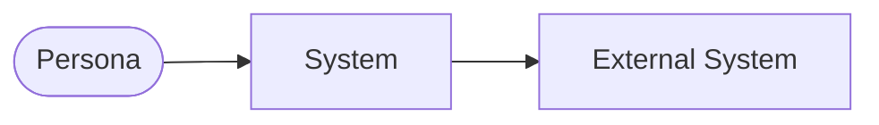
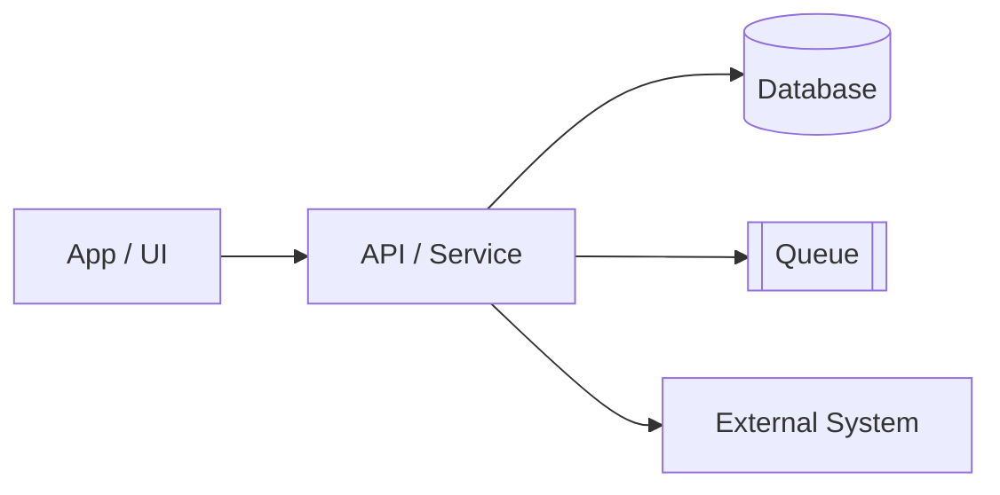
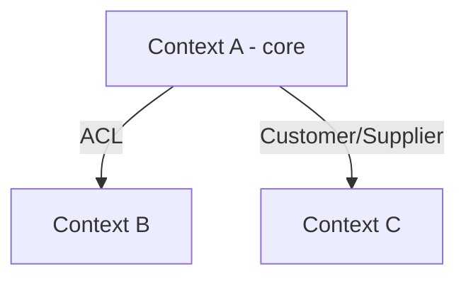

# Architecture Diagrams

> High level (C4 L1-L2 + bounded context map). Generated/updated by `/diagramar`.
> Renders on GitHub and in Claude Code. Keep in sync with `context-map.md` and `design.md`s.

## 1. System context (C4 L1)
> The system at the center, with personas and external systems.

## 2. Containers (C4 L2)
> The running pieces (UI, services, data, queues) and how they talk.

## 3. Bounded context map (DDD)
> The system's contexts and the relationship pattern between them.

