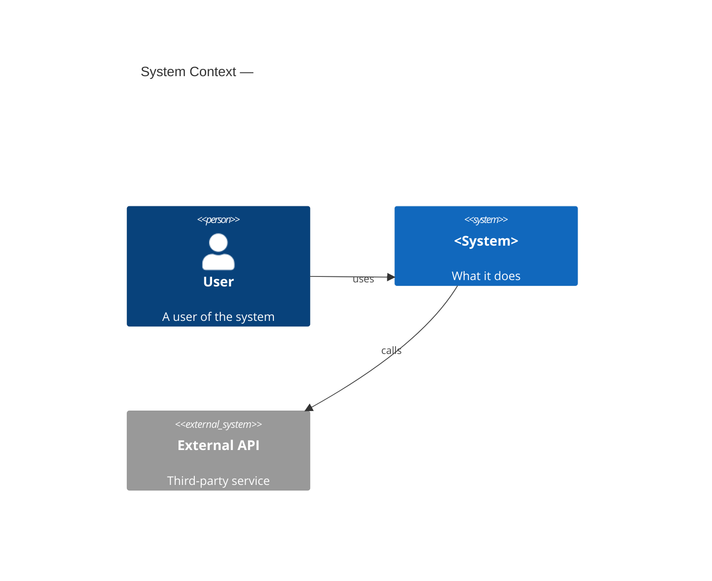
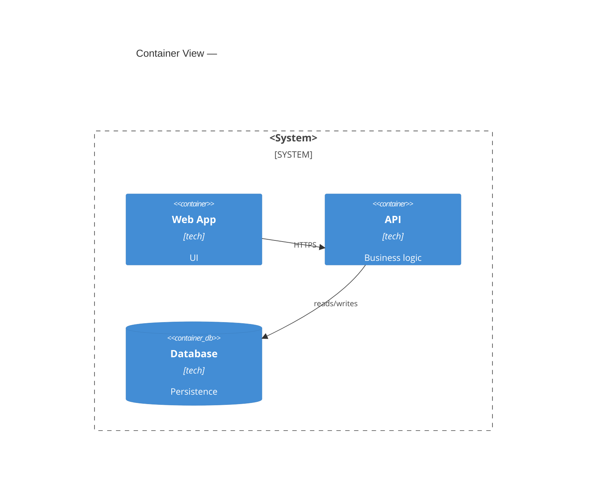
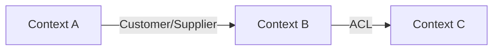

# Skill: Diagram (Mermaid Architecture)

Generates high-level architecture diagrams using the C4 model in Mermaid syntax.
Reads existing docs to ensure diagrams reflect the current understanding.

## Phase 1 — Load context (Research)

1. `read_file` these docs (pull only what exists):
   - `docs/product/vision.md` — what the system does, who uses it.
   - `docs/architecture/context-map.md` — bounded contexts and relations.
   - `docs/architecture/overview.md` — any existing architecture description.
   - `docs/architecture/assessment.md` — detected stack and architecture (brownfield).
   - `docs/architecture/diagrams.md` — existing diagrams (re-run updates these).
2. If greenfield with no docs yet, interview briefly: "What are the main external actors/systems and the core containers?"

> Context budget: this phase should be under 15k tokens. If diagrams.md is large, read only the sections relevant to the requested diagram level.

## Phase 2 — Generate C4 L1: System Context (Plan + Implement)

1. Draw actors (people, external systems) interacting with the central system.
2. Keep it to one system in the center — this is the highest zoom level.

3. Validate: every actor from `vision.md` appears. No implementation detail at this level.

## Phase 3 — Generate C4 L2: Containers (Plan + Implement)

1. Break the central system into containers: web app, API, database, message queue, etc.
2. Show inter-container relationships and external system calls.

3. Keep high-level: containers, not classes. One diagram per system boundary.

## Phase 4 — Generate Bounded Context Map (Plan + Implement)

1. Read `context-map.md` for the list of contexts and their relations (DDD patterns).
2. Render as a graph showing upstream/downstream relationships and integration patterns.

3. If `context-map.md` doesn't exist, generate it from the diagram and save both.

## Phase 5 — Save and validate

1. Write all diagrams to `docs/architecture/diagrams.md`.
2. Run `node scripts/validate-mermaid.mjs .` if available — fix any syntax errors.
3. Update `docs/STATE.md` with: diagrams updated, date.

## Rules

- **Keep it high-level.** C4 L1 and L2 only. No class diagrams, no sequence diagrams here.
- **Reflect reality.** If code differs from docs, note the discrepancy in STATE.md for review.
- **Idempotent:** re-running updates existing diagrams, doesn't duplicate them.
- Mermaid only — no external diagram tools. Version-controlled, diff-friendly.
