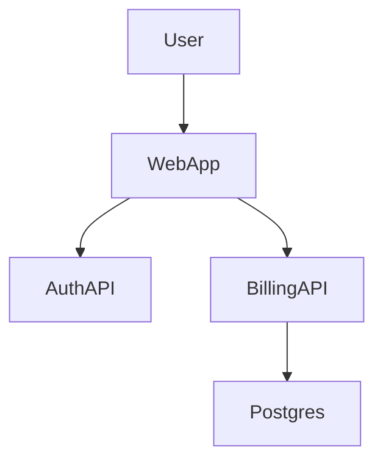

# Skill: diagramar

> C4 architecture diagrams (Context / Container / Component) as
> Mermaid. Pick the right level for the question.

## Decision tree

```
User wants to understand the architecture
        │
        ▼
What question are they answering?
        │
        ├── "What's in/out of this system?" ──► Context
        │
        ├── "How is it deployed?" ──► Container
        │
        ├── "How does billing work internally?" ──► Component
        │
        └── "What does THIS function do?" ──► Code (rarely; defer to inline comments)
```

## Workflow

### Step 1: pick the level

Match the level to the question. Don't start at Code — too much
detail to see the system. Don't start at Context if the user wants
to refactor billing.

### Step 2: gather inputs

- For Context: read `docs/product/vision.md` + assessment.md's
  external dependencies
- For Container: read Dockerfile, k8s manifests, deployment scripts
- For Component: read `docs/architecture/context-map.md` + the
  module's top-level package structure

### Step 3: write the diagram

Use Mermaid syntax. Validate by rendering mentally before
committing:



### Step 4: add narrative

After each diagram, write 2-3 sentences explaining what to look
at and what the diagram does NOT show.

## Examples

### Example 1: Context diagram

**Question**: "What systems does billing-api talk to?"

**Output**: diagram showing `billing-api`, `stripe`, `postgres`,
`email-service`, with arrows for each integration.

### Example 2: Container diagram

**Question**: "How is this deployed?"

**Output**: diagram showing the API server, worker, postgres,
redis, with technology choices and protocols.

## Anti-patterns

- ❌ Starting at Code level. Too much detail to see the system.
- ❌ Diagram without narrative. Just decoration.
- ❌ Mixing levels in one diagram. Confusing.

## Failure modes

| Gate | Failure | Recovery |
|------|---------|----------|
| `level-chosen` | User can't articulate the question | Default to Context. Refine. |
| `diagram-renders` | Mermaid syntax broken | Re-write, render in mermaid.live. |

## Related skills

- `mapear` — provides input data
- `adr` — diagrams sometimes accompany ADRs